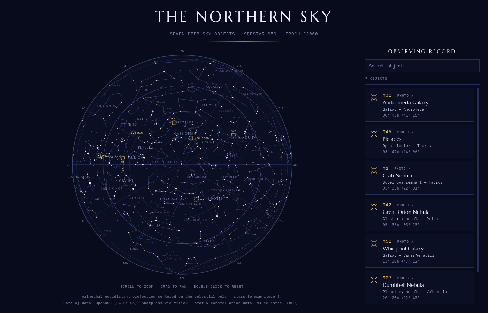

# uranometria

Star-atlas style HTML sky charts marking the deep-sky objects *you* have
photographed — with constellations, a coordinate grid, per-object colors, and
click-to-view hero images. The generated page is interactive: scroll to zoom
(markers stay readable and separate as the field spreads), drag to pan,
double-click to reset, and a sidebar observing record with its own scrollbar
and a search box that spotlights matches on the chart — built for lists from
a handful of showpieces up to a hundred-plus targets.

Named for Johann Bayer's
[*Uranometria*](https://en.wikipedia.org/wiki/Uranometria) (1603), the first
atlas to chart the entire celestial sphere and the origin of the Greek-letter
star names we still use. Bayer engraved every star anyone had ever measured;
you only have to photograph yours — this tool does the engraving.



A full sample lives in [`examples/`](examples/) — open
[`examples/skymap.html`](examples/skymap.html) in a browser (regenerate it with
`uv run uranometria examples/skymap.yaml`). Click any marker or legend card to
see the photograph behind it.

## Install

```sh
uv tool install uranometria            # once published
uv tool install ~/Projects/uranometria # from a local checkout
```

Or as a dependency of another project:

```sh
uv add uranometria                            # once published
uv add uranometria @ git+https://github.com/devonjones/uranometria  # from git
```

## CLI

```sh
uranometria skymap.yaml                 # writes skymap.html next to the config
uranometria skymap.yaml -o map.html
uranometria skymap.yaml --offline       # never call the online resolver
```

## Config

```yaml
title: The Northern Sky        # optional
subtitle: ...                  # optional
mag_limit: 5.0                 # optional — faintest stars drawn
show_ecliptic: true            # optional
objects:
  - M31                        # bare designation
  - id: Sh2-142                # catalog lookup + overrides
    label: NGC 7380
    name: Wizard Nebula
  - label: PN G75.5+1.7        # fully manual entry
    name: Soap Bubble Nebula
    type: Planetary nebula
    constellation: Cygnus
    ra: "20h15m22s"            # or decimal degrees, or "20:15:22"
    dec: "+38 21 18"
    image: images/soap.jpg     # optional — click marker/legend to view;
                               #   resolved relative to the output HTML and
                               #   validated at build time (http(s) also OK)
    color: "#E06C75"           # optional — marker/legend accent, any CSS color
```

Designations resolved offline from bundled catalogs: **Messier** (including
M40/M45/M102), **NGC/IC** (OpenNGC), **Sharpless** (Sh2-1…313),
**Caldwell** (C1–C109), **Barnard 33**, **Melotte**, and common names OpenNGC
knows ("Pleiades", "Horsehead Nebula"). Anything else (vdB, Collinder, Abell,
Arp, …) falls back to the CDS Sesame online resolver, or can be entered
manually with `ra`/`dec`.

If any object sits south of declination −35°, a southern-hemisphere chart is
added automatically.

## Library API

YAML is only the CLI's concern — the library takes plain dicts, so a host
application can build the config straight from its own object database:

```python
import uranometria

config = {
    "title": "My Sky",
    "objects": [
        "M31",
        {"id": "Sh2-142", "label": "NGC 7380"},
        {"label": "M81", "name": "Bode's Galaxy", "type": "Galaxy",
         "constellation": "Ursa Major", "ra": 148.888, "dec": 69.065,
         "image": "heroes/m81.jpg", "color": "#7EC8A0"},
    ],
}
warnings = uranometria.generate(config, "out/map.html")   # writes the file
html, warnings = uranometria.render(config, image_base="out")  # or just the HTML
```

`generate`/`render` accept `allow_online=False` to forbid the Sesame fallback
(useful for hosts that must stay offline). Errors that prevent any chart at
all raise `uranometria.SkymapError`; per-object problems (unresolvable id,
missing image file) come back as warning strings and the object is skipped or
rendered without its photo.

## Integrating (e.g. m110)

A workflow manager that already knows each object's designation, coordinates,
and hero image can bypass every lookup by passing fully-specified entries —
`generate` then works offline and deterministically. The suggested pattern is
an optional dependency that degrades gracefully:

```python
try:
    import uranometria
except ImportError:
    uranometria = None   # feature hidden / "install uranometria" hint

def publish_skymap(objects, out_path):
    cfg = {"objects": [
        {"label": o.display_id, "name": o.name, "type": o.type,
         "constellation": o.constellation, "ra": o.ra_deg, "dec": o.dec_deg,
         "image": os.path.relpath(o.hero_path, out_path.parent)}
        for o in objects if o.has_captures
    ]}
    return uranometria.generate(cfg, out_path)
```

## Data & licenses

- [OpenNGC](https://github.com/mattiaverga/OpenNGC) (CC-BY-SA-4.0) — NGC/IC/Messier/Caldwell records
- Sharpless (1959) via [VizieR VII/20](https://cdsarc.cds.unistra.fr/viz-bin/cat/VII/20) — Sh2 positions
- [d3-celestial](https://github.com/ofrohn/d3-celestial) (BSD-3) — stars to mag 6, constellation lines & names
- Fonts: Marcellus, IBM Plex Mono (SIL OFL), embedded as data URIs
- Online fallback: [CDS Sesame](https://cds.unistra.fr/cgi-bin/Sesame) name resolver

Code: Apache-2.0.
